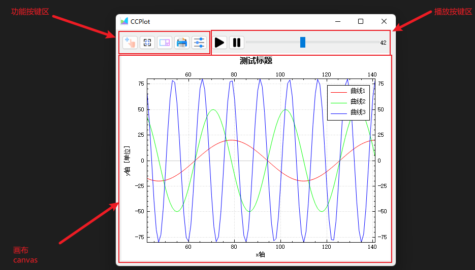

# CCplot
# Custom Custom Plot
基于QCustomplot自己封装的的绘图库

## 编译与运行
```
.\config.bat
.\build.bat
.\run.bat
```

```
cmake -B build -DCMAKE_BUILD_TYPE=Debug -DCMAKE_MSVC_PARALLEL=16
cmake --build build
.\build\Debug\ccplot.exe
```

## 使用
以CMake为例
- 下载源码
- 编译得到`libccplot.lib`
- 在CMakeLists.txt中,添加
```
#CCPlot
SET(CCPlot_INCLUDE_DIR D:/Code/CCplot/install/include)
SET(CCPlot_LIB D:/Code/CCplot/install/lib/libccplot.lib)
SET(CCPlot_RESOURCE D:/Code/CCplot/source/ccplot.qrc)

include_directories(
#...
    ${CCPlot_INCLUDE_DIR}
    ）

link_directories(${CCPlot_LIB})

target_link_libraries(yourProject PRIVATE
#...
    ${CCPlot_LIB}
    )
```

## 示例


- 支持动态曲线（动图演示）


- 静态图-自由缩放拖动


- 打印界面


- 静态图-全画布缩放


- 静态图-保持比例模式


- 详细设置界面


- 右键菜单


## 使用
### 1.静态图
- 创建一类继承自`CCPlot`
- 根据需求实现以下两虚函数
```cpp
//进行画布设置
void TestPlot::makeGraph() {
  //1.标题
  TitleProp t(QString::fromLocal8Bit("测试标题"),
              QFont("Microsoft YaHei", 12, QFont::Bold));
  addTitle(t);

  //2.坐标轴
  AxisProp xAxis(QString::fromLocal8Bit("x轴"),
                 RangeProp(0, 100));
  setAxis(xAxis, axisPosition::atDown);

  AxisProp yAxis(QString::fromLocal8Bit("y轴 [单位]"),
                 RangeProp(0, 100));
  setAxis(yAxis, axisPosition::atLeft);

  showMainAxis(true);
  showSubAxis(true);

  //3.图例
  showLegend(true);

  //4.播放区
  showPlayWidgets(true);
}

//更新曲线
void TestPlot::update() {
  CurveProp C1(QString::fromLocal8Bit("曲线1"), QColor(255, 0, 0));
  CurveProp C2(QString::fromLocal8Bit("曲线2"), QColor(0, 255, 0));
  CurveProp C3(QString::fromLocal8Bit("曲线3"), QColor(0, 0, 255));

  for (size_t i = 0; i < 100; i++) {
    C1.xx.append(i);
    C2.xx.append(i);
    C3.xx.append(i);

    C1.yy.append(20 * sin(0.1 * i));
    C2.yy.append(50 * sin(0.2 * i));
    C3.yy.append(80 * sin(0.5 * i));
  }

  addCurve(C1, ReplotPolicy::fullCanvas);
  addCurve(C2, ReplotPolicy::fullCanvas);
  addCurve(C3, ReplotPolicy::fullCanvas);

}

```

### 2.动态图
- 创建一类继承自`CCPlot`
- 根据需求实现以虚函数
```cpp
void TestPlot::timingUpdate() {
  static int start = 0;

  start++;

  setPlayWidgetsLabel(QString::number(start));

  QVector<double> xx1, yy1;
  QVector<double> xx2, yy2;
  QVector<double> xx3, yy3;

  for (size_t i = start; i < start + 100; i++) {
    xx1.append(i);
    xx2.append(i);
    xx3.append(i);

    yy1.append(20 * sin(0.1 * i));
    yy2.append(50 * sin(0.2 * i));
    yy3.append(80 * sin(0.5 * i));
  }

  updateCurve(0, xx1, yy1, ReplotPolicy::fullCanvas);
  updateCurve(1, xx2, yy2, ReplotPolicy::fullCanvas);
  updateCurve(2, xx3, yy3, ReplotPolicy::fullCanvas);
}
```

```cpp
//main.cpp

#include <QApplication>
#include "testplot.h"

int main(int argc, char* argv[]) {
  QApplication a(argc, argv);
  TestPlot p(nullptr);
  p.show();
  p.makeGraph();
  p.update();
  return a.exec();
}

```